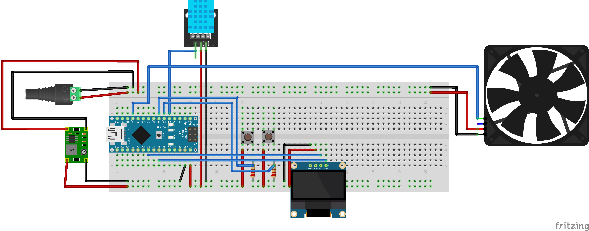

# Arduino Fan Controller

`make` to compile, upload and monitor the serial output.  
`make flash` to upload the compiled code to the arduino.  
`make monitor` to monitor the serial output.  
`make clean` to clean the compiled files.  

### Environent

- [AVR Toolchain setup wsl2](https://www.tonymitchell.ca/posts/setup-avr-toolchain-on-wsl/#option-1-using-usbip)
- [Attach usb device to wsl2](https://learn.microsoft.com/windows/wsl/connect-usb#attach-a-usb-device)
- Install `sudo apt install arduino arduino-core-avr arduino-mk avrdude`

Attach USB to WSL2: `bashusbipd attach --wsl --busid 1-1`

### Hardware

